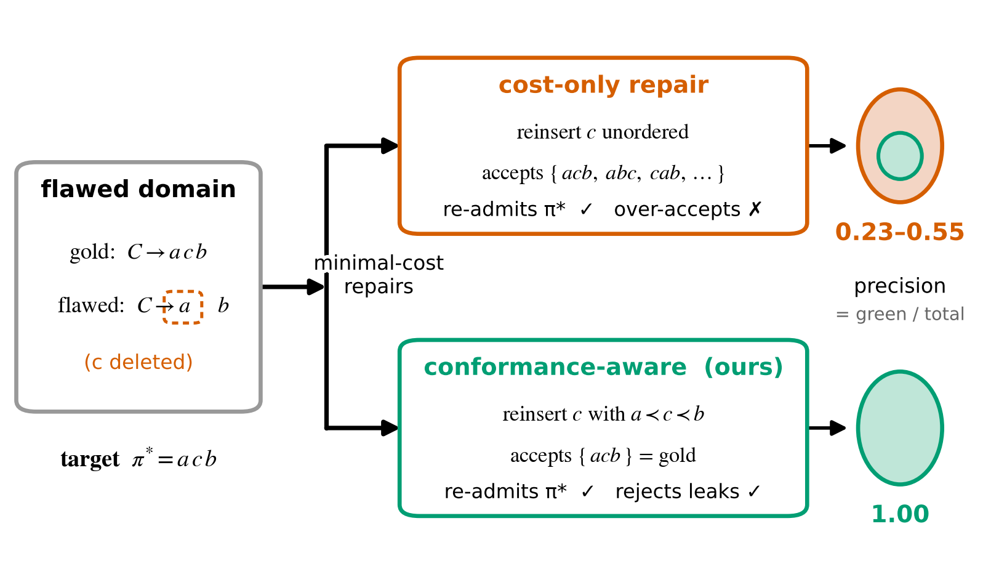

# Conformance-Aware Repair of HTN Planning Domains

Repairing a flawed HTN domain is usually framed as making a *target plan* derivable
again at minimum edit cost. That objective is **precision-blind**: several equal-cost
repairs can all re-admit the target while disagreeing about which *other* plans the
domain accepts, and the cost objective cannot tell them apart. Borrowing **precision**
from process-mining conformance checking, this repo formalizes the gap, proves the
incumbent objective leaves it open, and gives a repair that closes it.



## Key results

| Setting | Incumbent (cost-only) | Conformance-aware (ours) |
|---|---|---|
| Synthetic, ambiguous families | 2/3 of min-cost repairs over-accept | precision **1.0**, gap **0** in the control |
| Real IPC-2020, totally ordered | two SOTA LLM repairs median **0.3%** valid | — |
| Real IPC-2020, partial order (9 domains) | expected precision **0.55** | **1.0** via optimal precedence recovery |

The verifier (CFG/CYK membership) is **differentially tested** against a brute-force
oracle; the study is **deterministic, offline, and zero-runtime-dependency**; `426`
tests pass. See [`paper.tex`](paper.tex) for the write-up and [`docs/THEORY.md`](docs/THEORY.md)
for the proofs (precision-blindness; optimal partial-order recovery).

## Install

```bash
pip install -e .          # core (no third-party runtime deps), Python 3.10+
pip install -e ".[dev]"   # + pytest
```

## Reproduce

```bash
python -m tcr.cli demo                  # the conformance gap on the minimal example
python -m tcr.cli all                   # synthetic experiments -> results/*.json
python -m tcr.experiments.run_po_indifference   # partial-order corpus -> results/
pytest -q                               # full suite (verifier differential tests incl.)
cd figures && for f in fig_*.py; do python "$f"; done   # rebuild figures/out/*.{pdf,png}
```

Pre-computed `results/*.json` and `figures/out/` are committed, so the figures and the
paper build without re-running anything.

## Data

The large external benchmarks are **not** committed (~3.5 GB). To reproduce the
real-IPC numbers, place them under `data/`:

- `data/zenodo_lutalo/` — the Lutalo & Bercher TO-HTN repair benchmark (Zenodo).
- `data/ipc2020-domains/` — the IPC-2020 partial-order track (HDDL domains).

Tests that need these directories skip cleanly when they are absent; the synthetic
study and all committed results reproduce without any download.

## Layout

```
src/tcr/         core: CFG verifier, corruption, repair candidates, selector,
                 conformance metrics, partial-order recovery, optional LLM proposer
tests/           verifier differential tests, pipeline, leak-gadget, PO corpus guards
experiments/     synthetic (E1–E4) and partial-order runners
figures/         publication figures (one script per figure -> out/*.{pdf,png})
results/         committed experiment outputs (every paper number traces here)
docs/            theory (proofs), framing, related work, partial-order notes
paper.tex        the paper (stock LaTeX; swap in the AAAI class for submission)
```

`CLAUDE.md` is an engineering-oriented tour for continued development.

## License

Released under the MIT License — see [`LICENSE`](LICENSE).
